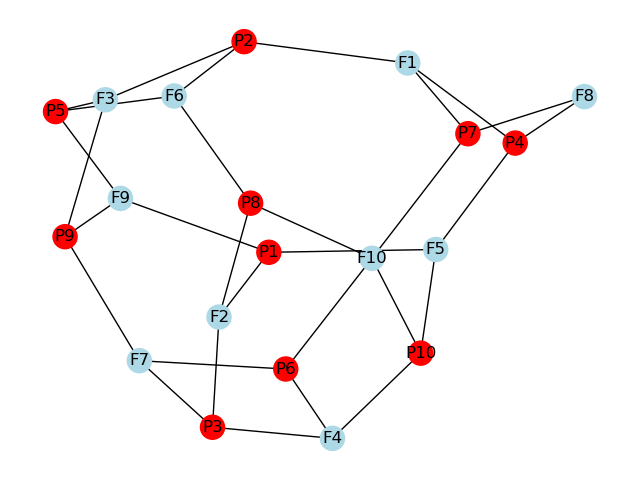

# Team Dragon

**CISC320 Spring 2023 Lesson 19 - Graph Applications**

Group Members:
* Nick Lago (nlago@udel.edu)
* Hongbo Wang (frankw@udel.edu)
* Patrick Harris (pdharris@udel.edu)
* John Henry Cooper (jhcoop@udel.edu)

Description of project

## Installation Code

```sh
$> pip install networkx
$> pip install matplotlib
```

## Python Environment Setup

```python
import networkx as nx
import matplotlib.pyplot as plt
```

# First Problem Title

**Informal Description**: 
Campus.csv contains information about how far different neighbor buildings are from each other on a college campus. It then uses this information to draw a campus map, with buildings shown as circles and paths between them shown as lines. The map is color-coded to make it easier to read. The code then figures out the shortest way to get from one building to any other building on the map, and prints out those directions so that people can find the quickest route from Computer Department Headquarters, Smith Hall, to their destination.

> **Formal Description**:
>  * Input: Campus.csv
            The input of the program is a file named "Campus.csv" which contains a list of edges with their corresponding weights. Each line in the file represents an edge, and the format of each line is "start, end, weight". For example, "Smith Hall,Ewing Hall,53" represents an edge from "Smith Hall" to "Ewing Hall" with a weight of 53.
>  * Output: 
            The output of the program is the shortest path from the starting node "Smith Hall" to all other nodes in the graph, where the shortest path is defined as the path with the minimum total weight.
            Additionally, the program displays a visualization of the graph using the networkx and matplotlib libraries, which shows the nodes and edges of the graph, as well as their corresponding weights.


**Graph Problem/Algorithm**: [SSSP(Djikstras)]


**Setup code**:

    import matplotlib.pyplot as plt 
    import networkx as nx

    with open("Campus.csv") as data_file:
        lines = data_file.readlines()

    G=nx.Graph()

    for line in lines:
        start, end, weight = line.strip("\n").split(",")
        weight=float(weight)
        G.add_edge(start, end, cost=weight)

    pos = nx.spring_layout(G)
    nx.draw_networkx(G, pos, node_color="orange", node_size=300,
                     font_size=8,
                     font_color="black",
                     edge_color="blue",
                     width=1,
                     with_labels=True)
    
    nx.draw_networkx_edges(G, pos, edge_color="blue",
        style="solid", 
        width=1)

    distance = nx.get_edge_attributes(G,"cost")

    nx.draw_networkx_edge_labels(G, pos, edge_labels=distance,
        label_pos=0.5, 
        font_size=7,
        font_color="red",
        font_weight="normal",
        horizontalalignment="center", 
        verticalalignment="top",
        rotate=True, 
        clip_on=True)
    
    plt.show()

**Visualization**:


**Solution code:**

    routes = nx.shortest_path(G, "Smith Hall", weight="cost")
    for key in routes:
        distance = nx.shortest_path_length(G, "Smith Hall", key, weight="cost")
        print("The shortest path from Smith Hall to", key, ":", routes[key], "with the distance of", distance, "meters")
        # print("\n")

**Output**

    The shortest path from Smith Hall to Smith Hall : ['Smith Hall'] with the distance of 0 meters
    The shortest path from Smith Hall to Ewing Hall : ['Smith Hall', 'Ewing Hall'] with the distance of 53.0 meters
    The shortest path from Smith Hall to Kirkbride Lecture Hall : ['Smith Hall', 'Kirkbride Lecture Hall'] with the distance of 26.0 meters
    The shortest path from Smith Hall to Purnell Hall : ['Smith Hall', 'Purnell Hall'] with the distance of 77.0 meters
    The shortest path from Smith Hall to Gore Hall : ['Smith Hall', 'Gore Hall'] with the distance of 38.0 meters
    The shortest path from Smith Hall to Sharp Lab : ['Smith Hall', 'Gore Hall', 'Sharp Lab'] with the distance of 77.0 meters
    The shortest path from Smith Hall to Mitchell Hall : ['Smith Hall', 'Gore Hall', 'Mitchell Hall'] with the distance of 65.0 meters
    The shortest path from Smith Hall to Du Pont Hall : ['Smith Hall', 'Gore Hall', 'Du Pont Hall'] with the distance of 94.0 meters
    The shortest path from Smith Hall to Hullihen Hall : ['Smith Hall', 'Gore Hall', 'Mitchell Hall', 'Hullihen Hall'] with the distance of 137.0 meters
    The shortest path from Smith Hall to Alfred Lerner Hall : ['Smith Hall', 'Purnell Hall', 'Alfred Lerner Hall'] with the distance of 132.0 meters
    The shortest path from Smith Hall to Amy du Pont Music Building : ['Smith Hall', 'Purnell Hall', 'Amy du Pont Music Building'] with the distance of 157.0 meters
    The shortest path from Smith Hall to Wolf Hall : ['Smith Hall', 'Gore Hall', 'Du Pont Hall', 'Wolf Hall'] with the distance of 112.0 meters
    The shortest path from Smith Hall to Evans Hall : ['Smith Hall', 'Gore Hall', 'Du Pont Hall', 'Evans Hall'] with the distance of 110.0 meters
    The shortest path from Smith Hall to Spencer Lab : ['Smith Hall', 'Gore Hall', 'Du Pont Hall', 'Spencer Lab'] with the distance of 174.0 meters
    The shortest path from Smith Hall to Life Sciences Research Facility : ['Smith Hall', 'Gore Hall', 'Du Pont Hall', 'Spencer Lab', 'Life Sciences Research Facility'] with the distance of 229.0 meters
    The shortest path from Smith Hall to Memorial Hall : ['Smith Hall', 'Gore Hall', 'Mitchell Hall', 'Hullihen Hall', 'Memorial Hall'] with the distance of 182.0 meters
    The shortest path from Smith Hall to Brown Lab : ['Smith Hall', 'Gore Hall', 'Mitchell Hall', 'Hullihen Hall', 'Brown Lab'] with the distance of 181.0 meters   
    The shortest path from Smith Hall to Roselle Center for the Arts : ['Smith Hall', 'Purnell Hall', 'Amy du Pont Music Building', 'Roselle Center for the Arts'] with the distance of 236.0 meters
    The shortest path from Smith Hall to East Hall : ['Smith Hall', 'Gore Hall', 'Du Pont Hall', 'Spencer Lab', 'East Hall'] with the distance of 233.0 meters      
    The shortest path from Smith Hall to Colburn Lab : ['Smith Hall', 'Gore Hall', 'Du Pont Hall', 'Spencer Lab', 'Colburn Lab'] with the distance of 197.0 meters  
    The shortest path from Smith Hall to Graham Hall : ['Smith Hall', 'Gore Hall', 'Du Pont Hall', 'Spencer Lab', 'Graham Hall'] with the distance of 232.0 meters  
    The shortest path from Smith Hall to Lammot du Pont Lab : ['Smith Hall', 'Gore Hall', 'Mitchell Hall', 'Hullihen Hall', 'Brown Lab', 'Lammot du Pont Lab'] with the distance of 190.0 meters
    The shortest path from Smith Hall to Drake Hall : ['Smith Hall', 'Gore Hall', 'Mitchell Hall', 'Hullihen Hall', 'Brown Lab', 'Drake Hall'] with the distance of 215.0 meters
    The shortest path from Smith Hall to Morris Library : ['Smith Hall', 'Gore Hall', 'Mitchell Hall', 'Hullihen Hall', 'Memorial Hall', 'Morris Library'] with the distance of 302.0 meters
    The shortest path from Smith Hall to Pearson Lab : ['Smith Hall', 'Gore Hall', 'Du Pont Hall', 'Spencer Lab', 'Colburn Lab', 'Pearson Lab'] with the distance of 239.0 meters

**Interpretation of Results**:

    The program prints the shortest path for each node in the graph in the format "The shortest path from Smith Hall to [node]: [path]", where [node] is the name of the destination node and [path] is a list of nodes representing the shortest path from "Smith Hall" to the destination node.


# Minimum Distance Path (Kruskals)

**Informal Description**: Kruskals Algorithm finds the minimum spanning tree of a given weighted undirected graph. In this case, the algorithm finds the flight path with the minimum distance covered in order to still reach every location/airport.

> **Formal Description**:
>  * Input: Flights.csv:  
NY,NJ,4
NY,RI,7
NJ,CT,6
RI,CT,1
CT,PA,10
RI,PA,5
FL,TX,14
FL,OK,8
OK,TX,4
TX,KY,5
KY,MN,4
MN,IL,6
MN,OH,8
IL,OH,1
CT,VA,7
KY,LO,4
LO,AK,3
LO,MS,5
MS,AK,1
NJ,ME,6
NY,NH,3
TX,CO,8
TN,AK,10
NH,TX,45
RI,MS,16
ME,FL,20
OK,MS,5
IL,TN,50
OH,CO,60
AK,PA,55  

>  * Output: Graph with 20 nodes and 19 edges
('RI', 'CT', {'d': 1.0})
('IL', 'OH', {'d': 1.0})
('AK', 'MS', {'d': 1.0})
('NY', 'NH', {'d': 3.0})
('LO', 'AK', {'d': 3.0})
('NY', 'NJ', {'d': 4.0})
('TX', 'OK', {'d': 4.0})
('KY', 'MN', {'d': 4.0})
('KY', 'LO', {'d': 4.0})
('RI', 'PA', {'d': 5.0})
('TX', 'KY', {'d': 5.0})
('NJ', 'CT', {'d': 6.0})
('NJ', 'ME', {'d': 6.0})
('MN', 'IL', {'d': 6.0})
('CT', 'VA', {'d': 7.0})
('FL', 'OK', {'d': 8.0})
('TX', 'CO', {'d': 8.0})
('AK', 'TN', {'d': 10.0})
('RI', 'MS', {'d': 16.0})

**Graph Problem/Algorithm**: [MST (Kruskals)]


**Setup code**:

import matplotlib.pyplot as plt  
import networkx as nx

**Visualization**:

  
Minimum spanning tree is shown in blue dashed lines over the edges.

**Solution code:**

```
    def main():
    with open("Flights.csv") as data_file:
        lines = data_file.readlines()
    
    G=nx.Graph()

    for line in lines:
        start, end, weight = line.strip("\n").split(",")
        weight=float(weight)
        G.add_edge(start, end, d=weight)

    MST = nx.minimum_spanning_tree(G, weight="d", algorithm="kruskal")
    
    pos = nx.spring_layout(G)

    nx.draw_networkx(G, 
        pos, 
        node_color='#0091e6', 
        node_size=300,
        font_size=7,
        font_color='white',
        edge_color='black',
        font_weight='bold',
        width=3,
        with_labels=True)

    nx.draw_networkx_edges(MST, 
        pos, 
        edge_color='#0091e6',
        style='dashed', 
        width=3)

    nx.draw_networkx_edge_labels(G, pos, 
        label_pos=0.5, 
        font_size=4, 
        font_color='k', 
        font_family='sans-serif',
        font_weight='bold', 
        horizontalalignment='center', 
        verticalalignment="bottom",
        rotate=True, 
        clip_on=True)
        
    plt.axis('off')
    plt.show()
    print(nx.minimum_spanning_tree(G, weight="d", algorithm="kruskal"))
    
main()
```

**Output**

```
    Graph with 20 nodes and 19 edges
(‘RI’, ‘CT’, {‘d’: 1.0})
(‘IL’, ‘OH’, {‘d’: 1.0})
(‘AK’, ‘MS’, {‘d’: 1.0})
(‘NY’, ‘NH’, {‘d’: 3.0})
(‘LO’, ‘AK’, {‘d’: 3.0})
(‘NY’, ‘NJ’, {‘d’: 4.0})
(‘TX’, ‘OK’, {‘d’: 4.0})
(‘KY’, ‘MN’, {‘d’: 4.0})
(‘KY’, ‘LO’, {‘d’: 4.0})
(‘RI’, ‘PA’, {‘d’: 5.0})
(‘TX’, ‘KY’, {‘d’: 5.0})
(‘NJ’, ‘CT’, {‘d’: 6.0})
(‘NJ’, ‘ME’, {‘d’: 6.0})
(‘MN’, ‘IL’, {‘d’: 6.0})
(‘CT’, ‘VA’, {‘d’: 7.0})
(‘FL’, ‘OK’, {‘d’: 8.0})
(‘TX’, ‘CO’, {‘d’: 8.0})
(‘AK’, ‘TN’, {‘d’: 10.0})
(‘RI’, ‘MS’, {‘d’: 16.0})
```

**Interpretation of Results**: These results tell the traveler the path that connects all states' airports in the least distance covered. This can be useful for anyone who is looking to travel to multiple destinations, and wants to be time efficient in doing so. A minimum spanning tree can also be a helpful visual for airlines when choosing optimal routes to fly.

# Determining if there are enough pilots to fly every flight (Breadth First Search)

**Informal Description**: 
The airport has a list of available pilots and a list of flights in need of a pilot. The problem is that each pilot has 
certain flights that conflict with their schedule or location, meaning that they are not able to pilot these flights.
Additionally, some flights conflict with other flights. Given the list of pilots, flights, and conflicts per flight, 
the airport wants a simple algorithm to tell them if they have enough pilots to fly each plane.
> **Formal Description**:
>  * Input: An undirected, unweighted graph. Each vertex either represents a pilot or a flight. Each edge connects
 a pilot to a flight that conflicts with their schedule (one that they can not pilot) or two flights that conflict.

>  * Output: A printed output, saying either "The graph is bipartite. 
 There are enough pilots to fly each flight without conflict" if the graph is bipartite or "The graph is not
 bipartite. More pilots are needed or modifications need to be made to their schedules." if the graph is not 
 bipartite

   The methodology behind determining if the available pilots can fly every available flight revolves around 
determining if the input graph, which contains all flights (vertex), pilots (vertex), and conflicts (edge), is 
   bipartite, meaning that edges only connect pilots to flights, and not pilots to pilots or flights to flights. If
the graph is bipartite, this tells us that it is possible to assign the pilots to the flights in a way that avoids 
any conflicts. This is because the bipartite structure implies that there are no conflicts between pilots or 
between flights, and therefore any conflict can only occur between a pilot and a flight. In other words, if the 
graph is bipartite, it means that it is possible to schedule all the flights without any pilot having a conflict 
with their schedule, assuming that each flight requires a single pilot. This is accomplished by utilizing the 
built-in networkx function is_bipartite(), which takes a graph as an input and returns a boolean representing if 
the graph is bipartite or not. is_bipartite's source code  is based on BFS. It starts by arbitrarily selecting a 
node and assigning it to one of the two groups. It then adds all the neighbors of that node to group B. It then 
continues the process, alternately adding nodes to group A and group B, until all nodes have been assigned a group. 
At each step of the process, the algorithm checks whether there are any edges connecting nodes in the same group. 
If any such edges are found, the graph is not bipartite. Otherwise, the graph is bipartite.

**Graph Problem/Algorithm**: [BFS]


**Setup code**:

```
import networkx as nx
import matplotlib.pyplot as plt

# create a new undirected graph
G = nx.Graph()

# add 10 pilot nodes
for i in range(1, 11):
    G.add_node("P" + str(i), node_type="pilot")

# add 10 flight nodes
for i in range(1, 11):
    G.add_node("F" + str(i), node_type="flight")

# add edges between pilots and flights
# assuming that Pilot P1 conflicts with Flight F2, F5, F9
G.add_edge("P1", "F2")
G.add_edge("P1", "F5")
G.add_edge("P1", "F9")

# assuming that Pilot P2 conflicts with Flight F1, F3, F6
G.add_edge("P2", "F1")
G.add_edge("P2", "F3")
G.add_edge("P2", "F6")

# assuming that Pilot P3 conflicts with Flight F2, F4, F7
G.add_edge("P3", "F2")
G.add_edge("P3", "F4")
G.add_edge("P3", "F7")

# assuming that Pilot P4 conflicts with Flight F1, F5, F8
G.add_edge("P4", "F1")
G.add_edge("P4", "F5")
G.add_edge("P4", "F8")

# assuming that Pilot P5 conflicts with Flight F3, F6, F9
G.add_edge("P5", "F3")
G.add_edge("P5", "F6")
G.add_edge("P5", "F9")

# assuming that Pilot P6 conflicts with Flight F4, F7, F10
G.add_edge("P6", "F4")
G.add_edge("P6", "F7")
G.add_edge("P6", "F10")

# assuming that Pilot P7 conflicts with Flight F1, F8, F10
G.add_edge("P7", "F1")
G.add_edge("P7", "F8")
G.add_edge("P7", "F10")

# assuming that Pilot P8 conflicts with Flight F2, F6, F10
G.add_edge("P8", "F2")
G.add_edge("P8", "F6")
G.add_edge("P8", "F10")

# assuming that Pilot P9 conflicts with Flight F3, F7, F9
G.add_edge("P9", "F3")
G.add_edge("P9", "F7")
G.add_edge("P9", "F9")

# assuming that Pilot P10 conflicts with Flight F4, F5, F10
G.add_edge("P10", "F4")
G.add_edge("P10", "F5")
G.add_edge("P10", "F10")

# create a layout for the graph and draw it
pos = nx.spring_layout(G)
nx.draw(G, pos, with_labels=True, node_color=["red" if n[1]["node_type"] == "pilot" else "lightblue" for n in G.nodes(data=True)])

# show the graph on screen
plt.show()
plt.savefig("BFS_graph.png")

```

**Visualization**:



**Solution code:**

```
# check if the graph is bipartite
is_bipartite = nx.is_bipartite(G)
if is_bipartite:
    print("The graph is bipartite.")
    print("There are enough pilots to fly each flight without conflict.")
else:
    print("The graph is not bipartite.")
     print("More pilots are needed or modifications need to be made to their scheduling.")
```

**Output**

```
The graph is bipartite.
There are enough pilots to fly each flight without conflict.
```

**Interpretation of Results**:
Given the set of pilots, flights, and conflicts that construct the input graph, there is a possible pilot-flight
allocation such that each pilot can fly a flight that does not conflict with their schedule and each flight has a pilot.

# DFS (Depth-First-Search)

**Informal Description**:
Depth-First-Search(DFS) is an algorithm for searching a graph or tree data structure. In this case, the algorithm finds a path between two cities represented as nodes in a graph. The purpose of this code is to visualize a path taken by a flight from one city to another using a DFS Algorithm to find the path and creating a graphical representation of the flight connections.   

> **Formal Description**:
>  * Input: A directed graph of flights terminal consisting of keys representing the cities in the graph and the values and lists of adjacent vertices (destinations that can be reached from each city).
>  * Output: A list of cities that have been visited along the flight path.

**Graph Problem/Algorithm**: [DFS]


**Setup code**:

```
import networkx as nx
import matplotlib.pyplot as plt
from typing import Dict, Optional, Set, List

flights = {
    "NY": ["NJ", "RI", "NH"],
    "ME": ["NY", "RI", "OH"],
    "NJ": ["NY", "CT", "ME"],
    "RI": ["NY", "CT", "PA", "MS"],
    "CT": ["NJ", "RI", "PA", "VA"],
    "PA": ["RI", "CT", "AK"],
    "FL": ["TX", "OK"],
    "CO": ["OH", "PA", "MS"],
    "TX": ["FL", "OK", "KY", "CO"],
    "OK": ["FL", "TX", "MS"],
    "KY": ["TX", "MN", "LA"],
    "MN": ["KY", "IL", "OH"],
    "IL": ["MN", "OH", "TN"],
    "OH": ["MN", "IL", "CO"],
    "VA": ["CT"],
    "LA": ["KY", "AK", "MS"],
    "MS": ["RI", "OK", "LA", "AK"],
    "AK": ["PA", "TN", "MS"],
    "TN": ["RI", "KY"],
    "NH": ["NY"]
}

FLIGHT_START = "NY"
FLIGHT_END = "TN"
flight_path = flights_dfs(flights, FLIGHT_START, FLIGHT_END)


if flight_path is not None:
    print(" -> ".join(flight_path))

# Create an directed graph
G = nx.DiGraph(flights)

# construct list of tuples of edges of the graph of the form (vertex, connected node)
edges = [(key, value) for key in flights for value in flights[key]]

# all the edges the flight path takes
path_edges = []


for i in range(len(flight_path) - 1):
    current_flight = flight_path[i]
    future_flight = flight_path[i + 1]
    found_pair = list(
        # Filter the edges kist and keep only the edges where the first element is the current flight and the second element is the future flight
        # Converts the filtered list to a regular list and takes the first element
        filter(lambda x: x[0] == current_flight and x[1] == future_flight, edges))[0]
    # Append the selected edge
    path_edges.append(found_pair)


# Add edges to graph
G.add_edges_from(edges)

# Draw the Graph
pos = nx.spring_layout(G, seed=11, k=1)

# Draw the nodes that aren't included in the path
nx.draw_networkx_nodes(G, pos, nodelist=set(G.nodes) -
                       set(flight_path), node_color='#1f78b4')

# Draw the edges that aren't included in the path
nx.draw_networkx_edges(G, pos, edgelist=set(G.edges) -
                       set(path_edges))

# Draw the nodes in the path with a red color
nx.draw_networkx_nodes(G, pos, nodelist=flight_path, node_color='r')

# Draw the edges in the path with a red color
nx.draw_networkx_edges(G, pos, edgelist=path_edges, edge_color='r')

nx.draw_networkx_labels(G, pos)

plt.axis("off")
plt.savefig("DFS_graph.png")
plt.show()
```

**Visualization**:


**Solution code:**

```
def flights_dfs(graph: Dict[str, List[str]], start: str, end: str, visited: Optional[Set[str]] = None, path: List[str] = None):
    """
        Function: DFS (Depth-First-Search)
        Parameters: Graph: dictionary where the keys represent the vertices in the graph
                    Start: the starting vertex for the search
                    End: "the goal" vertex for the search
                    Visited: an optional set containing the vertices that have already been visited so far during the search
                    Path: an optional list containing the vertices visited so far, initially set to None
        Returns: None, if the function finishes looping through all the neighbors of the starting vertex without finding a path to the goal vertex,
                 else if it exists, this will return the path (as a list of vertices from the starting vertex to the end)
    """
    # If visited is None, set to an empty list
    if visited is None:
        visited = set()
    # If path is none, then set path to a list containing only the starting vertex
    if path is None:
        path = [start]
    # If the starting vertex is equal to the "goal" vertex, then return the path
    if start == end:
        return path
    # Add the starting vertex to the set of visited vertices
    visited.add(start)
    for vertex in graph[start]:
        # If the vertex has not been visited
        if vertex not in visited:
            # Create a new copy of the path list
            new_path = list(path)
            # Add the weight of the edge to the new path list
            new_path.append(vertex)
            dfs_result = flights_dfs(graph, vertex, end, visited, new_path)
            if dfs_result is not None:
                return dfs_result
    return None
```

**Output**
The path from New York to Maine: NY -> NJ -> ME
The path from New York to New Jersey: NY -> NJ
The path from New York to Rhode Island: NY -> NJ -> CT -> RI 
The path from New York to Connecticut: NY -> NJ -> CT
The path from New York to Pennsylvania: NY -> NJ -> CT -> RI -> PA
The path from New York to Florida: NY -> NJ -> CT -> RI -> PA -> AK -> TN -> KY -> TX -> FL
The path from New York to Colorado: NY -> NJ -> CT -> RI -> PA -> AK -> TN -> KY -> TX -> CO
The path from New York to Texas: NY -> NJ -> CT -> RI -> PA -> AK -> TN -> KY -> TX -> FL -> OK -> MS -> LA
The path from New York to Oklahoma: NY -> NJ -> CT -> RI -> PA -> AK -> TN -> KY -> TX -> FL -> OK
The path from New York to Kentucky: NY -> NJ -> CT -> RI -> PA -> AK -> TN -> KY
The path from New York to Minnesota: NY -> NJ -> CT -> RI -> PA -> AK -> TN -> KY -> TX -> CO -> OH -> MN
The path from New York to Illinois: NY -> NJ -> CT -> RI -> PA -> AK -> TN -> KY -> TX -> CO -> OH -> MN -> IL
The path from New York to Ohio: NY -> NJ -> CT -> RI -> PA -> AK -> TN -> KY -> TX -> CO -> OH
The path from New York to Virginia: NY -> NJ -> CT -> VA
The path from New York to Louisiana: NY -> NJ -> CT -> RI -> PA -> AK -> TN -> KY -> TX -> FL -> OK -> MS -> LA
The path from New York to Mississippi: NY -> NJ -> CT -> RI -> PA -> AK -> TN -> KY -> TX -> FL -> OK -> MS
The path from New York to Arkansas: NY -> NJ -> CT -> RI -> PA -> AK
The path from New York to Tennessee: NY -> NJ -> CT -> RI -> PA -> AK -> TN
The path from New York to New Hampshire: NY -> NH


**Interpretation of Results**:
The graph is represented as a dictionary where each key represents a city node and it's value represents the list of cities that are directly connected to that city. This program prints the flight path for each node in the graph starting from New York, in the format "NY --> next city --> next city" etc.
